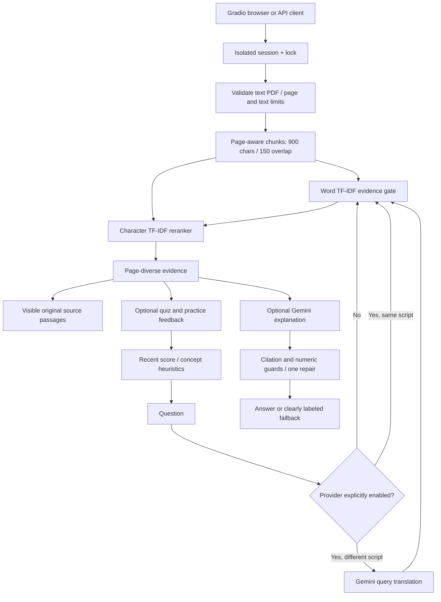

# Architecture — 0.9

## Modules

`app/retrieval.py` extracts text with pypdf, normalizes text, and builds sparse word and character TF-IDF matrices. Word similarity and query vocabulary coverage gate retrieval. Character n-grams rerank evidence; one passage per PDF page diversifies results. Scores are cosine similarities, **not confidence probabilities**.

`app/llm.py` optionally connects to Gemini. It requests answers from supplied evidence, checks that citations refer to supplied pages, rejects uncited substantive answers, and screens numeric values against the evidence. Questions do not count as numeric evidence. One repair is attempted before falling back. These are necessary checks, not a semantic entailment proof.

`app/tutor.py` coordinates retrieval, generation, quizzes, and review. `use_llm=False` forbids even query-translation calls. Personalized review uses the chosen concept as its retrieval query instead of diluting it with instruction text. Multi-part questions can expand the candidate page count to eight. Query-decomposition helpers remain experimental and are not in the active answer path.

`app/session_store.py` owns independent tutors and locks. API tokens are server-generated; random/expired tokens never allocate state. Defaults: 32 sessions, 60-minute idle expiry, checked lazily on store access. Browser unload/manual clearing removes browser state. Restarts discard all state. This is not authentication or durable storage.

`app/main.py` is the session-aware FastAPI interface. `demo.py` is the bilingual Gradio interface. `app.py` launches the CPU demo without requiring Hugging Face's `spaces` package.

`app/learner.py` keeps the last ten scores and up to five scores per concept. Difficulty boundaries are 0.5 and 0.8; weak concepts are below 0.75. The UI does not present the initial 0.5 default as a measured score. Total attempt count is separate from the rolling window. None of these thresholds are educationally validated.

## Resource boundaries and tradeoffs

One file per session, 20 MB upload limit, 300 PDF pages, one million extracted text characters, 2,000 chunks, bounded TF-IDF vocabularies, and bounded quiz/concept histories. Index construction is atomic: a failed replacement preserves the previous usable index. These limits are not a hostile-PDF sandbox; public hosting needs upstream body/rate limits and parser isolation.

TF-IDF is inexpensive and explainable but can miss paraphrases and retrieve topical text that does not answer the question. Arabic preprocessing is intentionally basic, not a morphological analyzer. Neural multilingual embeddings, OCR, databases, learner accounts, and teacher dashboards are not implemented.
